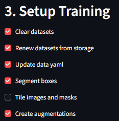
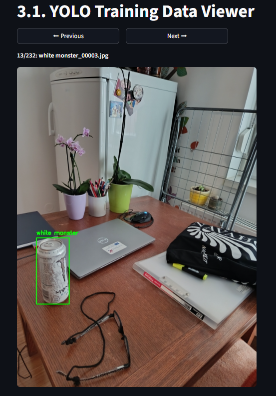

# Detect Anything

*A zero-to-train pipeline for object **detection** and **segmentation** with a point‑and‑click Streamlit UI. Collect data from videos or image archives, label it, assemble a clean YOLO‑style dataset, and fine‑tune a model — all in one place.*

---

## Table of Contents
- [What is this](#what-is-this)
- [Key features](#key-features)
- [Step‑by‑step tutorial](#step-by-step-tutorial-new-users)
  - [0) Install & launch](#0-install--launch)
  - [1) Add a class & collect raw images](#1-add-a-class--collect-raw-images)
  - [2) Label the images and import labels](#2-label-the-images-and-import-labels)
  - [3) Prepare the training set](#3-prepare-the-training-set)
  - [4) Train (fine-tune) the model](#4-train-fine-tune-the-model)
  - [5) Evaluate / real-time inference](#5-evaluate-real-time-inference)
- [Folder layout](#folder-layout)
- [Augmentations](#augmentations)
- [Tips & pitfalls](#tips--pitfalls)
- [FAQ](#faq)


---


## What is this
**Detect Anything** is a hands‑on pipeline to go from *idea → trained model* with minimal friction:
- Use a **Streamlit** app to guide you through data collection, labeling, dataset assembly, training, and evaluation.
- Works for **object detection** *and* **instance segmentation** (YOLO‑style).
- Designed to be **beginner‑proof**: the app renames files, keeps images and labels in sync, and builds the dataset structure for you.

## Results of 10-40 train samples and only 5 minute training
| Real life | Game |
|-----------|------|
|  |  |

## Key features
- **Video → frames**: extract frames from a video that contains your objects of interest.
- **Archive upload**: or upload a ZIP/RAR of your own images instead of using a video.
- **One source of truth for classes**: add class names once; reuse them across projects and training runs.
- **Smart renaming**: the app standardizes filenames so images and labels match 1‑to‑1.
- **Labeling loop**: open a labeling site, annotate, export, and import back — the app guides where to put things.
- **Split control**: pick your train/val split when importing.
- **Detection or segmentation**: choose your task during dataset prep; supports tiling for segmentation.
- **Augmentations**: globally configure how many augmented samples per original you want.
- **Training UX**: pick image size and epochs; the app writes the dataset config and launches training.
- **Evaluation**: visualize predictions in real‑time on your PC.

**GPU recommended.** Training and real‑time inference are fastest on NVIDIA GPUs with recent CUDA drivers.


---


## Step‑by‑step tutorial
This is the complete, beginner‑friendly path. Follow the steps in order.

### 0) Install & launch
1. **Install** [Anaconda/Miniconda] and **Git** (if not already installed).
2. **Clone** the repo and create the environment:
   ```bash
   git clone https://github.com/Alconno/detect-anything.git
   cd detect-anything
   conda create -n detect-anything python=3.10 -y
   conda activate detect-anything
   pip install -r requirements.txt
   ```
3. **Run the project setup**:
   ```bash
   python setup.py
   ```
4. **Start the UI**:
   ```bash
   streamlit run app.py
   ```
5. A browser tab opens with the app. Keep it running while you work.

> **Heads‑up on archives:** If you plan to upload **.rar** files, install an unpacker on your system (e.g., WinRAR/7‑Zip on Windows). ZIP works out of the box.


---


### 1) Add a class & collect raw images
You don’t pick your final training classes yet — you just **register a class** in the app’s class storage so images can be organized consistently. Later you can train on one or more of these classes.

**A. Define the class name**  
- In the app, go to the data setup section ("Add class" / "Create class"), enter a **class name** (e.g., `rhino`, `white monster`).

**B. Provide images for that class**  
Pick **one** of the two:
- **From a video**: upload a video containing your object(s). Use the **Frame Extraction** tool to sample frames. The app saves extracted images under the class you just created.
- **From an archive**: upload a **ZIP/RAR** of a folder with many images of that class.

<p align="center">
  
</p>

**C. Download (must do because of new image names)**  
After extraction/upload, the app offers a **Download** with standardized filenames. This renaming is important because labels will later use **exactly the same basenames**.

<p align="center">
  
</p>

> If you already uploaded a folder of images and you’re keeping them locally, you can skip the download — but ensure filenames match what the app expects if you label outside.


---


### 2) Label the images and import labels
Now you annotate those images at https://www.makesense.ai/ and bring labels back.

**A. Open a labeling website**  
- Click the app’s link/button to open a labeling site.
  - For **detection**, export labels in **YOLO bounding‑box format** (`.txt` per image, normalized coordinates).

**B. Label your data**  
- Draw boxes for each object instance.
- Make sure to pick the **same class names** you created in Step 1.

**C. Export & upload labels**  
- Export labels as a **ZIP/RAR** from the labeling site.
- Back in the app, **upload the archive** and choose how to **split** your data (e.g., 80% train / 20% val). The app will:
  - Validate that **image basenames == label basenames**.
  - Place files into the project’s **storage** with the correct layout.

<p align="center">
  
</p>


> From now on, your **images** and **labels** are synchronized and ready for training.


---


### 3) Prepare the training set
This step builds a clean YOLO dataset from the class storage.

<p align="center">
  
</p>


**A. Reset previous working set (optional)**  
- Use the app’s **clear/reset** button to wipe any previous working set if you want a fresh run.

**B. Choose the task**  
- **Detection** or **Segmentation**.  
  If you pick segmentation, you can also enable **tiling** (split big images/masks into tiles).

**C. Select classes to include**  
- Pick one or more previously added classes from storage.

<p align="center">
  
</p>

**D. Configure augmentations**  
- Set **how many augmented samples per original** you want.  
- You can also edit the augmentation code/config (see [Augmentations](#augmentations)).

**E. Generate & preview**  
- The app writes/updates your dataset config (e.g., `data.yaml`) with selected classes.  
- **Preview** the final samples in the UI: images with boxes, masks/polygons, tiling results — so you know exactly what will be used for training.

<p align="center">
  
</p>

---

### 4) Train (fine‑tune) the model
With the dataset ready, kick off training.

**A. Choose model type**  
- The app automatically launches **detection** *or* **segmentation** training based on what you chose in Step 3.

**B. Pick training settings**  
- **Image size** (`imgsz`)  
- **Epochs**  
- (Optionally) batch size, learning rate, etc., if exposed in the UI.

**C. Start training**  
- Click **Train**. Training outputs are saved under `runs/…` (e.g., `runs/detect/train*` or `runs/segment/train*`).
- The best weights are typically in `runs/.../weights/best.pt`.

---

### 5) Evaluate / real‑time inference
Once training finishes:

- Use the **Real‑Time Detection / Segmentation** page in the app to run the model on live video or recorded footage.  
- This currently runs **on your PC** (GPU‑accelerated if available). If you capture video on a phone, copy/stream it to the PC; the app will process it there.


---

## Folder layout
The app maintains a consistent storage structure (simplified view):

```
my_dataset/
├── images/
│   ├── storage/
│   │   ├── train/<class_name>/
│   │   └── val/<class_name>/
│   ├── train/   # working set the trainer uses
│   └── val/
├── labels/
│   ├── storage/
│   │   ├── train/<class_name>/
│   │   └── val/<class_name>/
│   ├── train/   # working set (YOLO .txt or YOLO-seg format)
│   └── val/
└── masks/
    ├── train/
    └── val/
```

> **Why two levels (storage vs train/val)?**  
> *Storage* is your library of all collected/labeled data per class. The app assembles a *working set* (`images/train|val`, `labels/train|val`, `masks/train|val`) from that storage for each training run.

---

## Augmentations
- Global config lives in `tmp_aug_config.json` (and/or the augmentation module).
- You can **set the number of augmentations per sample** and adjust transforms in the augmentation code.
- Augmentations are applied when preparing the working set in **Step 3**.

Common transforms include flips, color jitter, blur, noise, random crops, etc. Tailor intensity to your data; too much can hurt performance.

---

## Tips & pitfalls
- **Names must match**: every `image.ext` must have a `image.txt` label with the same basename. The renaming step ensures this.
- **Class list is centralized**: add classes once; the app updates the dataset config so the same class ids are used throughout.
- **Train/val split**: choose the split during label import to avoid leakage.
- **Archives**: prefer **ZIP** unless you’ve installed RAR support on your system.
- **GPU drivers**: keep CUDA/cuDNN up to date for faster training/inference. Version >=12 advised.

---

## FAQ
**Q: Can I train on multiple classes at once?**  
Yes. Add each class to storage, label them, then include them together in **Step 3** when you assemble the training set.

**Q: Do I have to re‑label if I rename files?**  
No — just ensure image and label basenames match. Use the app’s renaming/download flow to stay safe.

**Q: Which label formats are supported?**  
YOLO bounding boxes for detection; YOLO‑style polygons for segmentation. Export those from your labeling tool.

**Q: Where are the weights saved?**  
Under `runs/detect/.../weights/` or `runs/segment/.../weights/` (look for `best.pt`).

**Q: Can I run real‑time on my phone?**  
Not directly. Capture on your phone, send to the PC, and run inference from the app there.

---


> Keep your CUDA/PyTorch versions compatible with your GPU drivers. If training fails to see the GPU, install the matching torch/torchvision wheels for your CUDA version.

---


